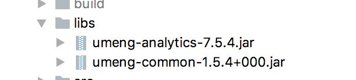

# 友盟数据统计的
集成文档地址 [官方文档](https://developer.umeng.com/docs/66632/detail/101848)

其中海外SDK的集成文档需要走单独的申请 [反馈申请地址](https://account.umeng.com/feedback/create?spm=a311a.9588098.0.0) 选择海外SDK申请


### 海外sdk集成步骤

1、 添加jar包（国内用在线加载、国外用本地）  和混淆代码

   

   添加混淆
   ```Java
   # 友盟的混淆文件开始
  -keep class com.umeng.** {*;}

  -keepclassmembers class * {
   public <init> (org.json.JSONObject);
  }

  -keepclassmembers enum * {
    public static **[] values();
    public static ** valueOf(java.lang.String);
  }
  # 友盟的混淆文件结束
   ```

2、添加权限和 key 和渠道名称

   ```xml
   <!--友盟统计开始的-->
    <uses-permission android:name="android.permission.ACCESS_NETWORK_STATE"/>
    <uses-permission android:name="android.permission.ACCESS_WIFI_STATE"/>
    <uses-permission android:name="android.permission.READ_PHONE_STATE"/>
    <uses-permission android:name="android.permission.INTERNET"/>
    <!--友盟统计结束-->
     <application
       .......
        <!-- 配置自己的key-->
       <meta-data android:value="5c6b6cf5b465f52783000999" android:name="UMENG_APPKEY"/>
       <!-- 配置渠道标识 -->
       <meta-data android:value="${UMENG_CHANNEL_VALUE}" android:name="UMENG_CHANNEL"/>
       <!-- 友盟统计结束-->
       .......
   ```


3、初始化   (国内和国外并不一样)
   在Application中的oncreat初始化
   ```Java
   /**
   * 初始化一些第三方的sdk
   */
  private void initUMSdk() {
      /**
       * 初始化友盟common库
       * 参数1:上下文，不能为空
       * 参数2:设备类型，UMConfigure.DEVICE_TYPE_PHONE为手机、UMConfigure.DEVICE_TYPE_BOX为盒子，默认为手机
       * 参数3:Push推送业务的secret
       */
      UMConfigure.init(this, UMConfigure.DEVICE_TYPE_PHONE, null);
      MobclickAgent.setScenarioType(this, MobclickAgent.EScenarioType.E_UM_NORMAL);
      /**
       * 设置组件化的Log开关
       * 参数: boolean 默认为false，如需查看LOG设置为true
       */
      UMConfigure.setLogEnabled(BuildConfig.DEBUG);
      /**
       * 设置日志加密
       * 参数：boolean 默认为false（不加密）
       */
      UMConfigure.setEncryptEnabled((!BuildConfig.DEBUG));
  }
   ```
4、检查页面的onresume  和 onpause
   必须确保在所有⻚页⾯面对应Activity中调⽤用 MobclickAgent.onResume() 和 MobclickAgent.onPause()⽅方法

   可以考虑在项目中的BaseActivity中加入以下代码
   ```Java
   @Override
   protected void onPause() {
       super.onPause();
       MobclickAgent.onPause(this);
   }

   @Override
   protected void onResume() {
       super.onResume();
       MobclickAgent.onResume(this);
   }
   ```
